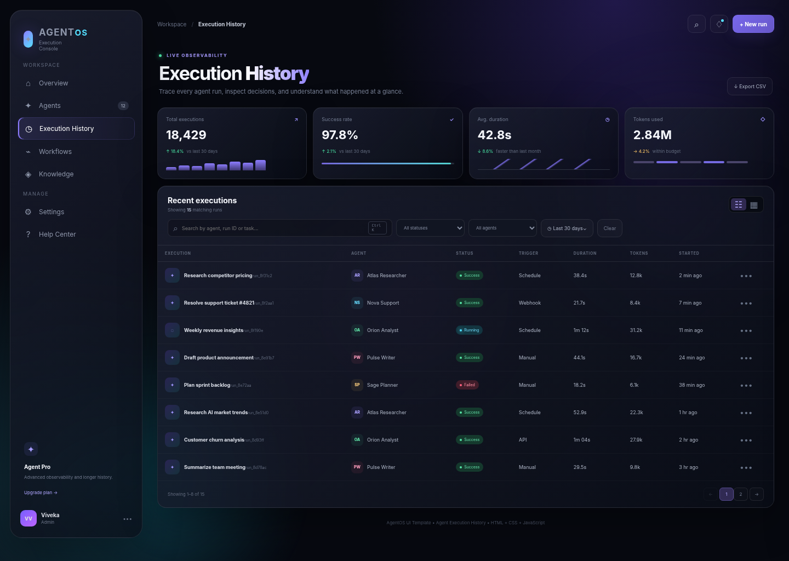
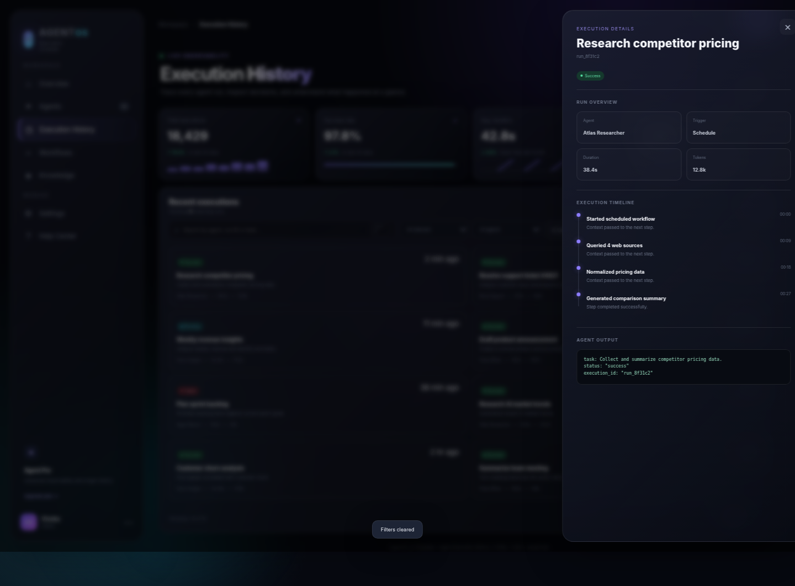
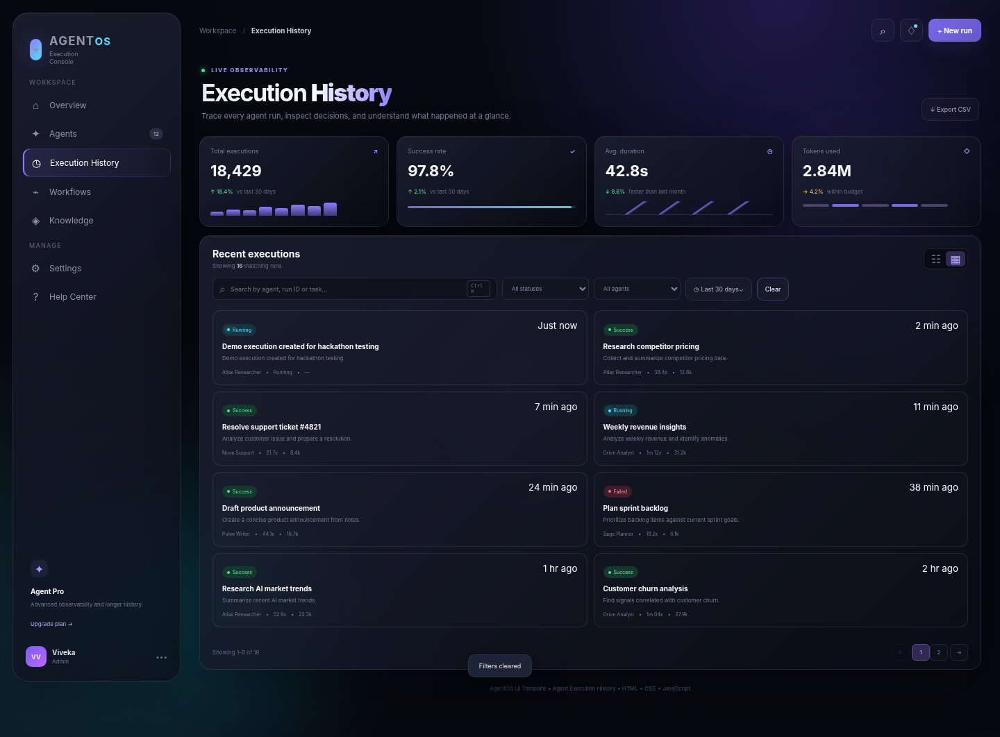
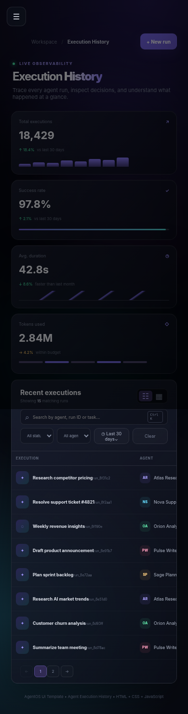

# AgentOS — Agent Execution History

A responsive, dependency-free **Agent Execution History** UI template for monitoring, filtering, and inspecting AI-agent runs.

## 1. UI Pattern

**Agent Execution History** is an observability interface that lets users review previous and active agent runs in one place. A user can quickly find a run, check its status, inspect execution steps, understand the task, and export the filtered history.

## 2. Where It Is Used

This pattern is useful in AI-agent platforms, automation tools, developer tools, workflow systems, and internal operations dashboards where users need to monitor agent activity and debug individual executions.

## 3. Why It Matters in Modern Web Interfaces

AI agents can perform many actions automatically, so users need a clear way to understand **what ran, when it ran, which agent ran it, whether it succeeded, how long it took, and what happened during the run**. An execution-history view turns this information into an easy-to-scan, interactive dashboard rather than a raw log.

## 4. Research / Design Observations

The design was informed by modern dashboard and UI-template patterns referenced in the hackathon brief, including ThemeForest, Kombai, Dribbble, Uizard, Material UI templates, and n8n workflow examples.

The main patterns observed and applied are:

- Dense but readable data tables for operational information
- Search and filter controls placed close to the data they affect
- Status badges for quick visual scanning
- Card/table view switching for different browsing preferences
- Side drawers for deeper details without leaving the current screen
- Timeline-style execution traces for understanding a process step by step
- Responsive navigation for smaller screens
- Lightweight interactions such as keyboard shortcuts, toasts, modals, and export actions

## 5. What This Implementation Adds

This implementation combines execution history and lightweight observability interactions in a single browser-only template. In addition to the history table, it includes:

- Live search across execution name, run ID, agent, status, trigger, task, and timeline steps
- Status, agent, and date-range filtering
- Table and card layouts
- Pagination
- Execution-detail side drawer with timeline
- New-run modal that adds an execution to the history immediately
- CSV export of the currently filtered results
- Notifications panel
- Settings toggles
- Help Center interactions
- Responsive mobile navigation
- `Ctrl/Cmd + K` search shortcut and `Esc` overlay shortcut

The template uses only **HTML, CSS, and Vanilla JavaScript**, so it can run directly from the downloaded files without a framework, package manager, or build step.

## Technologies Used

- HTML5
- CSS3
- Vanilla JavaScript
- No frameworks
- No external dependencies

## Project Structure

```text
agent-execution-history/
├── index.html
├── style.css
├── script.js
├── README.md
└── screenshots/
    ├── execution-history.png
    ├── execution-details.png
    ├── new-run.png
    └── mobile-view.png
```

## Screenshots

### Execution History



### Execution Details



### New Run



### Mobile Navigation



## How to Run

1. Download or clone the repository.
2. Open the `agent-execution-history` folder.
3. Double-click `index.html` or open it in a modern browser.
4. No installation, server, or build step is required.

## Testing

The final UI was checked for the main interactions, including:

- Search
- Status and agent filters
- Date-range cycling
- Clear filters
- Table/card view switching
- Pagination
- Execution detail drawer
- New run creation
- CSV export
- Notifications
- Settings controls
- Help interaction
- Keyboard shortcuts
- Responsive mobile navigation

Browser smoke testing completed successfully with no JavaScript console errors.

## GitHub Contribution

### Contributor

**Viveka** — UI development, JavaScript interactions, responsive styling, testing, and documentation for the Agent Execution History template.

### Required Team Information

Replace the placeholders below with your actual team information before the final team submission:

```text
Team Name: [ADD YOUR TEAM NAME]

Team Members:
1. Viveka — Agent Execution History UI
2. [ADD MEMBER NAME] — [CONTRIBUTION]
3. [ADD MEMBER NAME] — [CONTRIBUTION]
4. [OPTIONAL MEMBER NAME] — [CONTRIBUTION]
5. [OPTIONAL MEMBER NAME] — [CONTRIBUTION]
```

## Recommended GitHub Workflow

```text
Fork → Clone → Branch → Develop → Commit → Push → Pull Request → Review → Merge
```

Example branch name:

```bash
git checkout -b viveka-agent-execution-history
```

Example commit message:

```bash
git commit -m "Add Agent Execution History UI template"
```

## Pull Request Description

Use this description when creating the Pull Request:

```md
## Contribution

Added a responsive Agent Execution History UI template.

## Features

- Execution history table
- Search and filters
- Date-range filter
- Table/card view
- Pagination
- Execution detail drawer and timeline
- New run interaction
- CSV export
- Notifications
- Settings and Help interactions
- Responsive mobile navigation

## Technologies

- HTML5
- CSS3
- Vanilla JavaScript

## Testing

Tested the main interactions, responsive navigation, and CSV export in a modern Chromium browser.
```

## Research References

The following references were provided in the hackathon brief and were used as design inspiration for studying modern UI patterns:

1. ThemeForest — Site Templates: https://themeforest.net/category/site-templates
2. Kombai — Web UI Gallery: https://kombai.com/gallery/web/
3. Dribbble — UI: https://dribbble.com/tags/ui
4. Uizard — Templates: https://uizard.io/templates/
5. Material UI — Templates: https://mui.com/material-ui/getting-started/templates/
6. n8n — Workflows: https://n8n.io/workflows/
